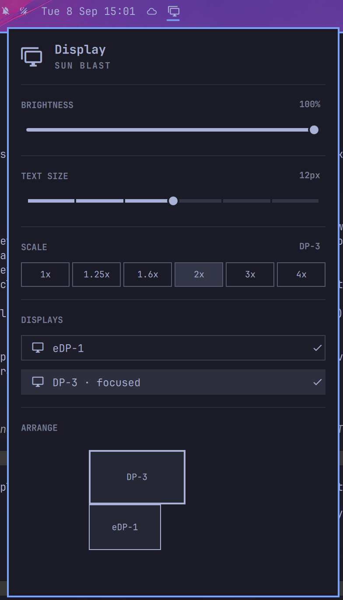

# Display Arrange

An Omarchy shell bar widget for display settings, based on the built-in
Display widget, with an added drag-to-arrange monitor layout.



## Features

- Brightness slider (when the focused display has a controllable backlight)
- Text size slider (shell font + GTK text scaling)
- Per-display scale presets
- Enable/disable individual displays
- **Arrange**: drag displays into position on a scaled-down canvas. Drops
  snap to align or touch the edges of your other displays, and a dropped
  position that would overlap another display is automatically nudged clear.
  Changes apply immediately (`hyprctl eval`) and are written into
  `~/.config/hypr/monitors.lua` so they survive a restart.

## Install

```
omarchy plugin add https://github.com/baelter/omarchy-display-arrange --enable
```

This adds the widget to your bar. If you also have the built-in Display
widget enabled, disable it first to avoid two display icons in the bar:

```
omarchy plugin disable omarchy.monitor
```

## Configuration

Move it in the bar like any other widget:

```
omarchy bar move io.github.baelter.display-arrange --section right
```

## Remove

```
omarchy plugin remove io.github.baelter.display-arrange
```

This only removes the widget from the bar; it does not touch
`~/.config/hypr/monitors.lua` or any monitor layout it already applied.

## Notes for reviewers

- No network access, no downloads, no privileged commands. Everything runs
  through `hyprctl`, `jq`, `bash`, and `perl`, all invoked locally.
- The only file it writes outside its own plugin directory is
  `~/.config/hypr/monitors.lua`, and only in direct response to the user
  dragging and dropping a display in the Arrange canvas — the drag-and-drop
  itself is the explicit user action that authorizes the change, the same as
  the existing Scale and per-display enable/disable controls in this same
  widget already do.
- Requires Hyprland's Lua config (`hl.monitor(...)`), used by Omarchy's
  default `monitors.lua` and by its own `omarchy-hyprland-monitor-scaling`
  CLI. The legacy `hyprctl keyword monitor` form does not work under it.
